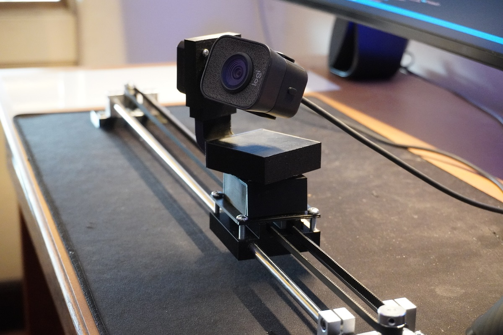

___

# 
**Gimbal** 

---
 

 Gimbal is a multi-axis webcam holder that allows for the easy adjustment of camera angles.  
  

 
 

    
    

Gimbal Functional Iteration One

___

# **Inspiration**

 The idea for Gimbal came from having to constantly readjust my camera during the numerous zoom meetings that I have taken part in. Wether it be my messy bed, or wanting to show a project, the camera had to be adjusted to meet the circumstances. With that in mind, I set out to create a multi-axis mechanism that would allow for the webcam to be altered through a joystick and buttons.

___

# **Timeline and Current Status** 

 
In the summer months of 2022, I had the idea of creating this using a DSLR camera that I owned. However, the project remained on the sidelines until I had a round of interviews set at the end of February. I thought that this project would be an interesting one to showcase while allowing me to move my camera to browse the other projects that I have stored around my room. 

It took me a combined total of 9 days of on and off work to go from the initial ideation sketches to a functional and aesthetic prototype that was ready for the interview.

Following the interview, I have continued to expand on the Gimbal by adding a larger stepper motor to the base to allow for future iterations that would not only accomadate larger camera modules, but could even be used to move a robotic arm that I hope to someday build. 

I have also created better cable management with the joystick and buttons by using a protoboard to solder the components onto. 

Current State of Gimbal

In the coming weeks, I anticipate having a final model that can be will be far more aesthically appealing 
and user friendly. 

I will also be adding a segment would use computer vision to collect data from the video feed to track my face or an object of interest to keep it centrally aligned, regardless of its movement. This movement of Gimbal will be paired with a visual representation of the data that I will be interpreting behind the scenes. 
___
